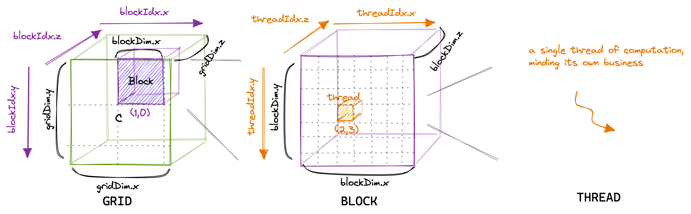

# CUDA Parallel Programming - Notes - Day 4

## **1. CUDA Thread Hierarchy and Execution Model**
- In CUDA, computations are organized into a **grid-block-thread hierarchy**.
- **Grid** → Contains multiple blocks.
- **Block** → Contains multiple threads and executes within a single SM (Streaming Multiprocessor).
- **Warp** → **Smallest parallel execution unit, consisting of 32 threads**.
- **Thread** → **Smallest execution unit running on a CUDA core**.

---

## **2. Warp Execution and SIMD Efficiency**
- CUDA follows the **SIMD (Single Instruction Multiple Data) execution model**.
- **Warp divergence** occurs when threads within a warp follow different execution paths, reducing efficiency.
  - **Control divergence** → Happens due to if-else branching.
- **Warp efficiency formula:**
  
  \[
  \text{SIMD Efficiency} = \frac{\text{Number of Active Threads}}{\text{Total Threads in Warp}} \times 100
  \]
  
- **Barrier synchronization (`__syncthreads()`) ensures that all threads within a block reach a certain execution point before proceeding.**
  - Not required within a warp in most cases.
  - Required when using **shared memory** in a block.

---

## **3. Kernel Performance and Occupancy Analysis**
- **Occupancy**: The ratio of active threads in an SM to the maximum supported threads.
  - Higher occupancy leads to better hardware utilization.
- **Kernel launch parameters and calculations:**
  - **Grid size**: Total threads / threads per block.
  - **Warps per block**: Threads per block / 32.
- **Boundary check divergence:** Some warps may have inactive threads due to index bounds.

---

## **4. Memory Architecture and Optimization Techniques**
- **CUDA memory types:**
  - **Register memory**: Fastest memory, private to each thread.
  - **Shared memory**: Shared among threads in a block, second-fastest memory.
  - **Global memory**: Accessible by all threads, but **significantly slower**.
- **Coalesced memory access:**
  - **Ensures optimal memory bandwidth usage by aligning memory accesses of threads within a warp.**
  - **Best practice:** Threads should access **consecutive memory addresses**.
  - **Poor practice:** Strided access patterns cause inefficient memory transactions.

- **Bank conflict in shared memory:**
  - **Shared memory is divided into memory banks. Each bank can only serve one access at a time.**
  - If multiple threads access the same bank, **a bank conflict occurs, causing delays**.
  - **Avoid conflicts by ensuring threads access different banks.**

---

## **5. Warp Scheduling and Parallel Execution Management**
- **Zero Overhead Scheduling:**
  - Warps waiting for long-latency operations (e.g., memory loads) are put to sleep.
  - Another warp is scheduled in their place to maximize execution efficiency.
- **Differences in old vs. new GPU architectures:**
  - **Older GPUs** → One SM could execute **only one warp at a time**.
  - **Newer GPUs** → One SM can execute **multiple warps simultaneously**.
- **Warp scheduling efficiency:**
  - **If there are enough warps, SM utilization remains high.**
  - **If there are too few warps, pipeline stalls, leading to lower efficiency.**

---

## **6. Streaming Multiprocessor (SM) Structure**
- **A GPU consists of multiple SMs (Streaming Multiprocessors).**
- **Each SM can execute multiple warps at a time and contains:**
  - **CUDA cores** → Execution units for threads.
  - **Warp scheduler** → Manages the execution of warps.
  - **Registers** → Fast, thread-private memory.
  - **Shared memory** → High-speed memory shared within a block.
- **SMs have access to global memory but with higher latency.**

📌 **Key Takeaways:**
- **Each SM can run multiple blocks, but resource limits (registers and shared memory) affect this number.**
- **Warp scheduling prevents idle SMs by swapping active warps in and out.**
- **To optimize CUDA performance, efficient use of shared memory and registers is crucial.**

